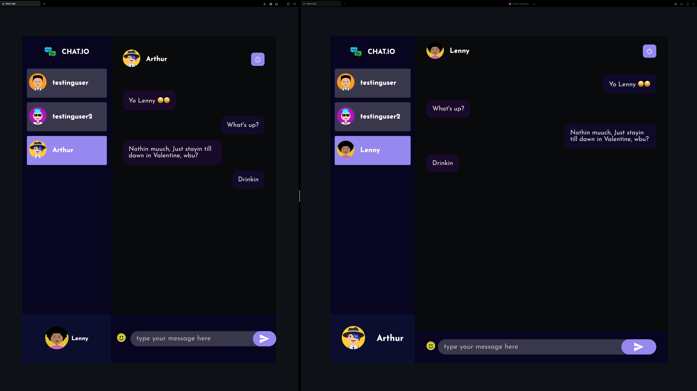

# Real Time Chat Application

## Overview

A feature rich app using React, Redux, Node.js, MongoDB, and Socket.io for seamless real-time messages with private and group chats.

Libraries used in Sever: Express, mongoose, nodemon, bcrypt, cors, dotenv, socket.io
Libraries used in Client: axios, styled-components, react-router-dom, redux, emoji-picker-react, react-icons, react-toastify, buffer, socket.io-client

## Steps to run
1. Run mongoDB database server

-   (To Install MongoDB on mac) `brew tap mongodb/brew` and `brew install mongodb-community`
-   To start: `brew services start mongodb-community`
-   To stop: `brew services stop mongodb-community`
-   Use _MongoDB Compass_ to see the database changes

2. Run Server

-   cd server
-   npm start

3. Run Client

-   cd public
-   npm start

## Screenshot

## Skills

-   React.js
-   Socket\.io
-   MongoDB
-   Express.js
-   Node.js
-   MERN stack
